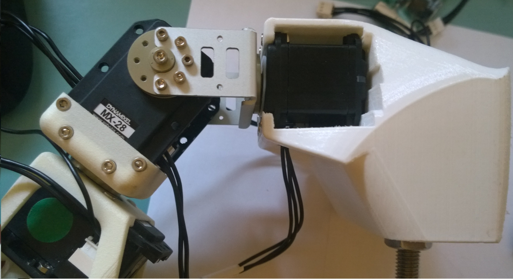
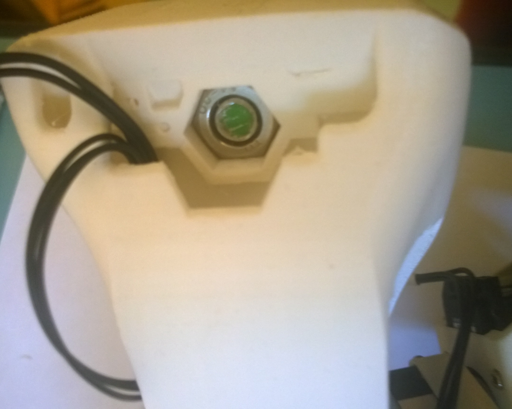
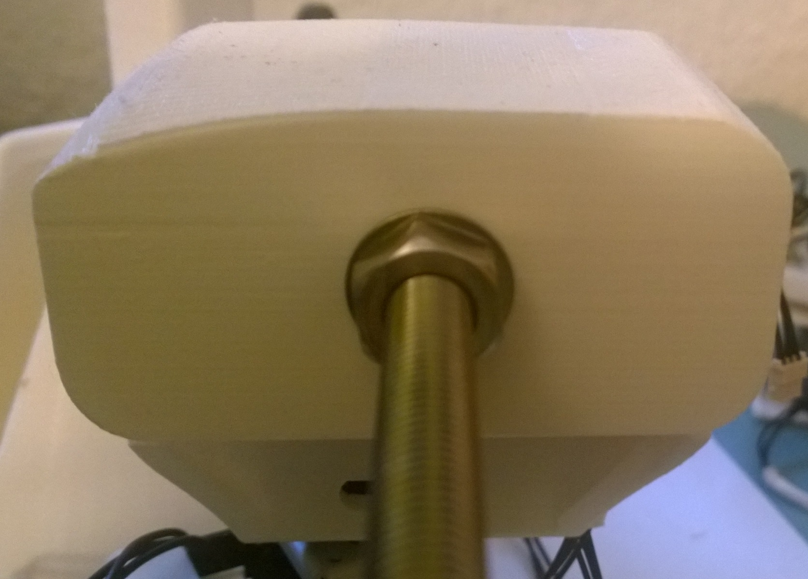
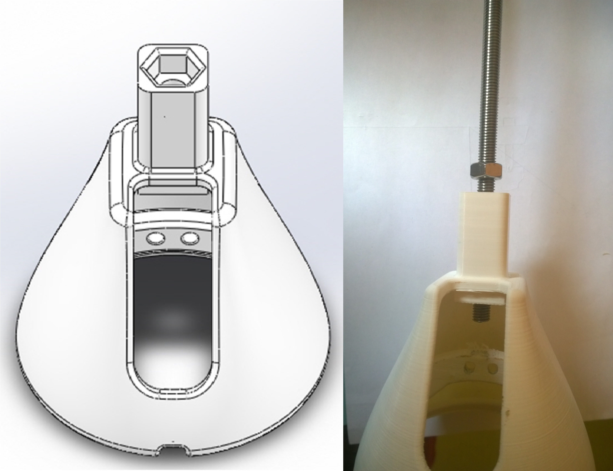
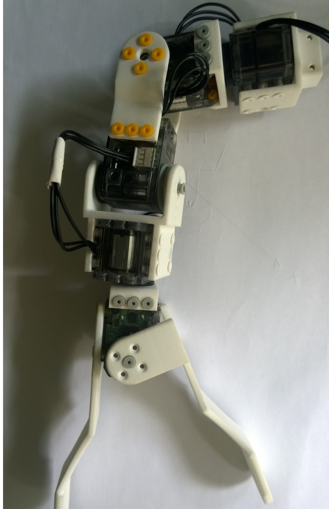
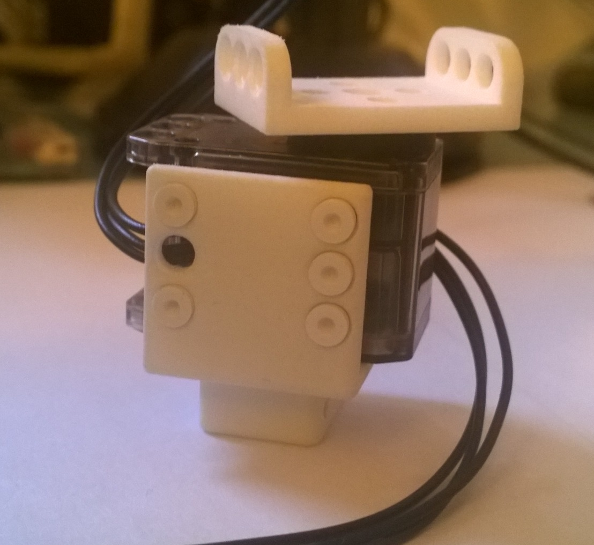
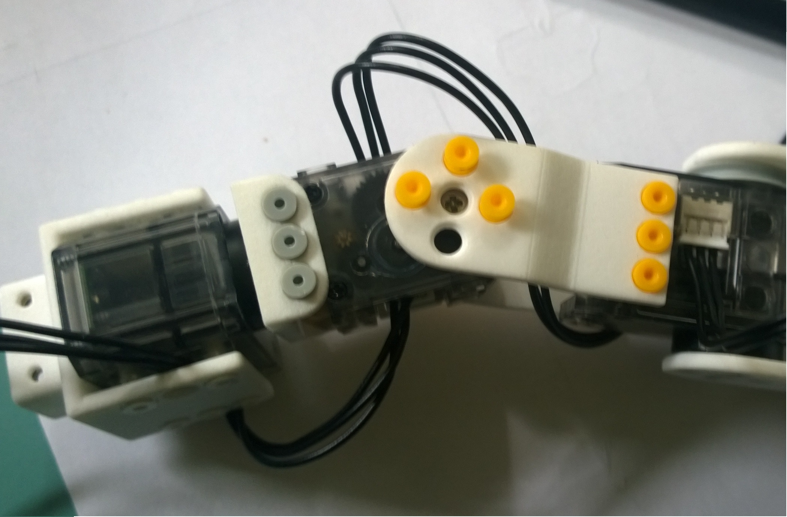

# Step by Step Assembly

## BOM

For building a Poppy right Arm, you will need:

* 5x robotis [XL-320] (http://www.generationrobots.com/en/401692-dynamixel-xl-320-servo-motor.html?search_query=OLLO&results=23)
* 10x [XL cable](http://www.generationrobots.com/en/402090-3p-130-mm-cables-for-xl-servos-x5.html)
* 2x [USB2AX] (http://www.generationrobots.com/en/401584-usb2ax-for-dynamixel-servos.html?search_query=usb2aX&results=5)
* 4x robotics [MX-28] (http://www.generationrobots.com/en/401080-dynamixel-mx-28t-actuator-robotis.html?search_query=MX-28T&results=15)
* 2x HN07-I101 [Horn](http://www.generationrobots.com/en/400939-hn07-i101-horn-and-bearing-set-for-dynamixel-actuators-robotis.html)
* 1x FR07-H101K [Set] (http://www.generationrobots.com/en/400917-fr07-h101k-set-robotis.html?search_query=FR07-H101K&results=2)
* 1x [TTL cable](http://www.generationrobots.com/en/401739-3p-cable-set-bcs-3p01-for-dynamixel-servo-motors.html?search_query=mx+cable&results=336)
* 1x small electronic board (see the [electronic section](electronic.md))
* 1x [Power Supply 12V - 5A] (http://www.trossenrobotics.com/p/power-supply-12vdc-5a.aspx)
* the 3D printed parts: [STL] (ingresar pagina web)
* 1x [threaded shaft](http://www.leroymerlin.fr/v3/p/produits/tige-filetee-en-acier-zingue-long-1-m-x-diam-10-mm-e54322) D:10mm L: min 45 cm
* 4x [Hex Nut](http://www.vis-express.fr/fr/ecrous-inox-a2-hu/19735-ECROU-HEXAGONAL-M10-INOX-DACROMET-8425001057.html) D:10 mm
* 1x [OLLO Pulley-L](http://www.generationrobots.com/en/401871-ollo-pulley-l-gray-5pcs.html?search_query=OLLO&results=23) and their rivets
* 1x [OLLO Tool](http://www.generationrobots.com/en/401872-ollo-tool.html)

## Assembling your robot

## Step 1

First for assambly the poppy right arm we can use poppy basic arms [Doc] (https://github.com/poppy-project/Poppy-basic-arms/blob/master/doc/right_arm_assembly_instructions.md)

## Step 2
Mount the arm of step 1, motor MX-28, FR07 and threaded shaft on the 3D printed suppport.

Always align the horn with the motor before assembling them (red circle)

## Step 3

Mount step 2 in the support for table.

## Step 4

Now we just need to mount the gripper, for do it, we have 3 possibilities each one gives the robot an additional degree of freedom.

3 degree of freedom

For mount each piece we need the OLLO Pulley, you can watch how connect each OLLO Pulley [slow motion](https://vimeo.com/125704291).

