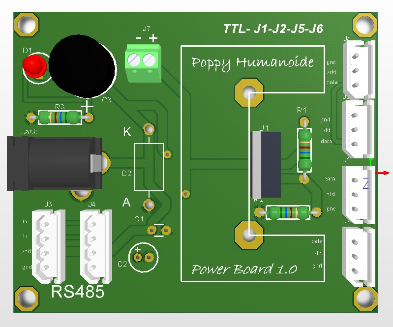

# About the Electronic

A small bit of electronic hacking is required for now. You need to power the XL-320 motors with 7.5V and the MX-28 with 12V.

The cables between motors have two purposes:

* Distribute alimentation to each motor
* Convey messages to each motor (ordering them to move or asking them for sensors' values)

Thus the alimentation should be added between the USB2AX (that deals with communication aspects) and the motors.
To this end simply create the following card that can power both type of motors.

## Bill of Materials

| Description    | Designator |   LibRef   |   Quantity   |
| --------------:|:----------:|:--------:|:--------:|
| CAP CER 0.1UF 50V 20% RADIAL           |    1     |          |          
| CAP ALUM 1.0UF 50V 20% RADIAL |    1     |          |
| Cap Aluminum Lytic 1000uF 25V |    1     |          |
| Standard LEDs |    6     |          |
| 1N5822     |    1     | Optional |
| 3P shrouded
| 4P shrouded
| 3CKT WTB VERT
| CONN 2POS
| CONN PWR JACK
|

Carbon Film Resistors - Through Hole 33KOhm 1/4W 1200PPM
3-Terminal Adjustable Regulator, 3-pin TO-220, Pb-Free
