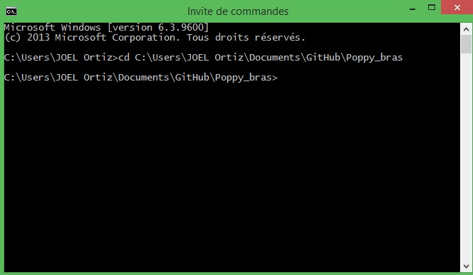

# About the Software

## Install Creature

you can donwload the creature in this [link](https://github.com/joelortizsosa/Poppy_bras_Creatures).To make the installation (in windows xp,7,8), It's necessary load  the command-line interpreter on Windows and then 
you need to be located in the folder of the creature:

Then you can install the library as follows

*If you dont have python and the software necessay already installed, you can follow these [instruccions](https://forum.poppy-project.org/t/poppy-on-windows-all-you-need-to-do/392)*
