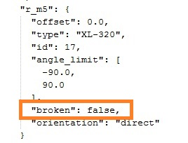

# About the Software

## Install Creature

you can donwload the creature in this [link](https://github.com/joelortizsosa/Poppy_bras_Creatures).To make the installation (in windows xp,7,8), It's necessary load  the command-line interpreter on Windows and then 
you need to be located in the folder of the creature:

Then you can install the library as follows

*If you dont have python and the software necessay already installed, you can follow these [instruccions](https://forum.poppy-project.org/t/poppy-on-windows-all-you-need-to-do/392)*

## Configuration of *.JSON

As the gripper of the arm can be configured to add different degrees of freedom, it is necessary to disable / enable the motors to be used. To do this you need to modify the configuration file, located at:

*C:\Python27\Lib\site-packages\poppy_right_arm-1.0.0-py2.7.egg\poppy_right_arm\configuration\poppy_right_arm.json*

Then you can open this file with the Notepad

* if you write "True", the motor will be disabled.

* if you write "False", the motor will be enabled.

Once these parameters are defined, we can now use the creature.

